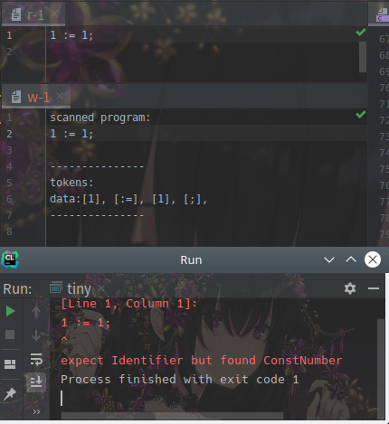
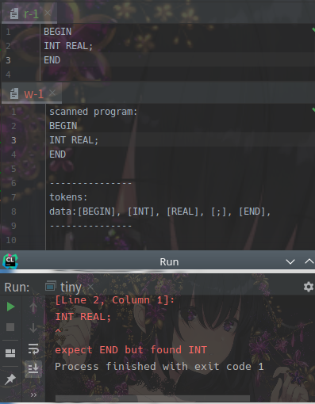
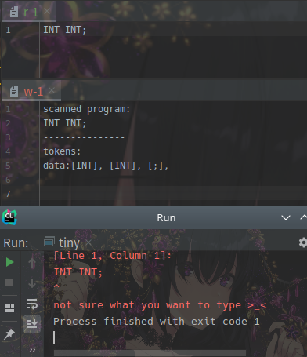

# tiny-lang parser

raw program -> token list -> AST

## Lexer

`token` 用记录 `content`, `type` 和 `file-position`的结构体表示

```c
typedef struct {
  string data;
  filepos pos;
  token_t type;
} token_data;
```

将源程序作为c语言字符数组传入, 暴力解析出token序列

```c
token_data** lexer(const char *input_data);
```

## Syntax Analyzer

本来也打算暴力把EBNF翻译成代码, 但是发现有很多重复, 写起来非常无聊, 于是打算依照写`Haskell`的经验写一套parser combinator

但是想了一会儿发现我不会将c语言像函数式语言一样将parser 给 compose起来

参考了一下[mpc](https://github.com/orangeduck/mpc)和hyh大神的实现, 发现将层级嵌套也可以做到, 真是太强了

最后实现是先按照EBNF生成一个在逻辑上等价的`parser tree`

```c
struct sa_parser_t {
  char *name;
  ast_node_t info;
  int type;
  sa_pdata_t data;
};
```

其中`sa_p_data_t`代表不同的单元逻辑

```c
typedef struct { int n; sa_parser_t **ps; } sa_pdata_and_t;
typedef struct { char *name; } sa_pdata_grammar_t;
typedef struct { sa_parser_t *p; } sa_pdata_ignore_t;
typedef struct { sa_parser_t *p; } sa_pdata_maybe_t;
typedef struct { int n; sa_parser_t **ps; } sa_pdata_or_t;
typedef struct { sa_parser_t *p; } sa_pdata_repeat_t;
typedef struct { token_t t; } sa_pdata_token_t;

typedef union {
  sa_pdata_and_t and;
  sa_pdata_grammar_t grammar;
  sa_pdata_ignore_t ignore;
  sa_pdata_maybe_t maybe;
  sa_pdata_or_t or;
  sa_pdata_repeat_t repeat;
  sa_pdata_token_t token;
} sa_pdata_t;
```

得到整个程序的`parser`之后直接将token序列apply上去即可

```c
int sa_run_parser (sa_input_t *in, sa_env_t *env, sa_parser_t *parser, sa_result_t **res);
```

+ 参数`in`表示输入的token序列,
+ 参数`env`表示构建AST时需要的环境, 这里仅维护从`parser name`到`parser`的映射

## 错误处理

+ 将文件`r-1`中的数据扔到`assign-statement parser`里 失败会在控制台输出错误信息



+ `block parser`的解析结果

  

+ 但是对于或逻辑可能遇到多种可能的错误, 这里不进行猜测

  

## 测试

对于样例数据, 编译运行`src/main.c`得到输出

```bash
scanned program:
/** this is a comment line in the sample program **/
 INT f2(INT x, INT y )
 BEGIN
    INT z;
    z := x*x - y*y;
    RETURN z;
 END
 INT MAIN f1()
 BEGIN
    INT x;
    READ(x, "A41.input");
    INT y;
    READ(y, "A42.input");
    INT z;
    z := f2(x,y) + f2(y,x);
    WRITE (z, "A4.output");
 END
---------------
tokens:
data:[INT], [f2], [(], [INT], [x], [,], [INT], [y], [)], [BEGIN], [INT], [z], [;], [z], [:=], [x], [*], [x], [-], [y], [*], [y], [;], [RETURN], [z], [;], [END], [INT], [MAIN], [f1], [(], [)], [BEGIN], [INT], [x], [;], [READ], [(], [x], [,], ["A41.input"], [)], [;], [INT], [y], [;], [READ], [(], [y], [,], ["A42.input"], [)], [;], [INT], [z], [;], [z], [:=], [f2], [(], [x], [,], [y], [)], [+], [f2], [(], [y], [,], [x], [)], [;], [WRITE], [(], [z], [,], ["A4.output"], [)], [;], [END], 
---------------
[prog]
->[method]
  ->[_]: INT 
  ->[_]: f2 
  ->[params]
    ->[_]
      ->[param]
        ->[_]: INT 
        ->[_]: x 
      ->[param]
        ->[_]: INT 
        ->[_]: y 
  ->[block]
    ->[_]
      ->[_]
        ->[_]: INT 
        ->[_]: z 
      ->[assign]
        ->[_]: z 
        ->[expr]
          ->[multi expr]
            ->[_]: x 
            ->[_]
              ->[_]: * 
              ->[_]: x 
          ->[_]
            ->[_]: - 
            ->[multi expr]
              ->[_]: y 
              ->[_]
                ->[_]: * 
                ->[_]: y 
      ->[return ]
        ->[_]: RETURN 
        ->[expr]
          ->[multi expr]
            ->[_]: z 
->[method]
  ->[_]: INT 
  ->[_]: MAIN 
  ->[_]: f1 
  ->[params]
  ->[block]
    ->[_]
      ->[_]
        ->[_]: INT 
        ->[_]: x 
      ->[read]
        ->[_]: READ 
        ->[_]: x 
        ->[_]: "A41.input" 
      ->[_]
        ->[_]: INT 
        ->[_]: y 
      ->[read]
        ->[_]: READ 
        ->[_]: y 
        ->[_]: "A42.input" 
      ->[_]
        ->[_]: INT 
        ->[_]: z 
      ->[assign]
        ->[_]: z 
        ->[expr]
          ->[multi expr]
            ->[_]
              ->[_]: f2 
              ->[actual params]
                ->[_]
                  ->[expr]
                    ->[multi expr]
                      ->[_]: x 
                  ->[expr]
                    ->[multi expr]
                      ->[_]: y 
          ->[_]
            ->[_]: + 
            ->[multi expr]
              ->[_]
                ->[_]: f2 
                ->[actual params]
                  ->[_]
                    ->[expr]
                      ->[multi expr]
                        ->[_]: y 
                    ->[expr]
                      ->[multi expr]
                        ->[_]: x 
      ->[write]
        ->[_]: WRITE 
        ->[expr]
          ->[multi expr]
            ->[_]: z 
        ->[_]: "A4.output" 
------FINISHED-----
```

